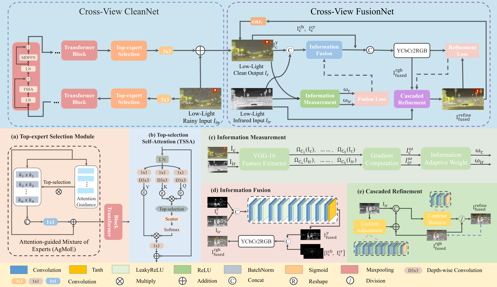
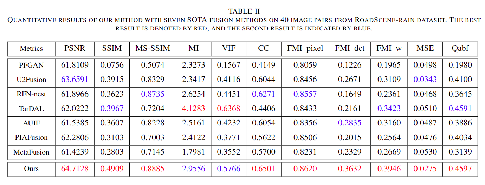

# NiteDR-Nighttime-Image-De-raining

## About
Codes for ***NiteDR: Nighttime Image De-Raining with Cross-View Sensor Cooperative Learning for Dynamic Driving Scenes***, **IEEE Transactions on Multimedia (TMM), 2024.**

*-[[Paper]](https://ieeexplore.ieee.org/document/10499836)*

*-[[ArXiv]](https://arxiv.org/abs/2402.18172)*

## Contents

- [Abstract](#Abstract)
- [Installation](#Installation)
- [Dataset](#Dataset)
- [Usage](#Usage)
  - [Network Architecture](#Network-Architecture)
  - [Training](#Training)
  - [Testing](#Testing)
- [NiteDR](#NiteDR)
  - [Illustration of our model](#Illustration-of-our-model)
  - [Qualitative results](#Qualitative-results)
  - [Quantitative results](#Quantitative-results)
- [Citation](#Citation)
 
## Abstract
In real-world environments, outdoor imaging systems are often affected by disturbances such as rain degradation. Especially, in nighttime driving scenes, insufficient and uneven lighting shrouds the scenes in darkness, resulting degradation of both the image quality and visibility. Particularly, in the field of autonomous driving, the visual perception ability of RGB sensors experiences a sharp decline in such harsh scenarios. Additionally, driving assistance systems suffer from reduced capabilities in capturing and discerning the surrounding environment, posing a threat to driving safety. Single-view information captured by single-modal sensors cannot comprehensively depict the entire scene. To address these challenges, we developed an image de-raining framework tailored for rainy nighttime driving scenes. It aims to remove rain artifacts, enrich scene representation, and restore useful information. Specifically, we introduce cooperative learning between visible and infrared images captured by different sensors. By cross-view fusion of these multi-source data, the scene within the images gains richer texture details and enhanced contrast. We constructed an information cleaning module called CleanNet as the first stage of our framework. Moreover, we designed an information fusion module called FusionNet as the second stage to fuse the clean visible images with infrared images. Using this stage-by-stage learning strategy, we obtain de-rained fusion images with higher quality and better visual perception. Extensive experiments demonstrate the effectiveness of our proposed Cross-View Cooperative Learning (CVCL) in adverse driving scenarios in low-light rainy environments. The proposed approach addresses the gap in the utilization of existing rain removal algorithms in specific low-light conditions.


## Installation
```
- python == 3.8.12    torch == 1.9.0+cu111   torchaudio == 0.9.0   torchvision == 0.10.0+cu111
- opencv-python == 4.8.1.78
- scikit-image == 0.21.0
- scikit-learn == 1.3.1
- numpy == 1.24.4   Pillow == 9.5.0   matplotlib == 3.7.3
- scipy == 1.10.1
- tensorboard == 1.13.0
- tqdm == 4.66.1
- pytorch-msssim == 1.0.0
```

## Dataset
Our RoadScene-rain dataset can be downloaded from [Google drive](https://drive.google.com/drive/folders/1R0qABZZazvB_3nOo24jgmuD5r1EQOaG8?usp=drive_link) and placed in the folder ``'./dataset/RoadScene-rain/'.``

## Usage

### Network Architecture

Our CleanNet is implemented in ``'./basicsr/models/archs/CLformer_arch.py'``. Our FusionNet is implemented in ``'Dense.py'`` and ``'refine.py'``.

### Training

**1. Preparation**

Download the pretrained vgg16 model from [Google drive](https://drive.google.com/file/d/1AANKTsmDfwG5vN02xx_Fh_g8sxYIrAuW/view?usp=sharing) and place it in the folder ``'./mdoel/'.``

**2. Information Cleaning Training**

Run 
```
CUDA_VISIBLE_DEVICES=0,1 python -m torch.distributed.launch --nproc_per_node=2 --master_port=4321 Cl_train.py --launcher pytorch --is_train --use_tb_logger --dist --use_grad_clip
```
and the trained model is available in ``'./expeiments/de-raining/checkpoints/'``.

**3. Cross-View Information Fusion Training**

Run 
```
CUDA_VISIBLE_DEVICES=0, python Fu_train.py --train_root_dir 'Path of the training images' --derained_checkpoint_dir 'Path of the de-raining model' --model_path 'Path to save the fusion checkpoint' --fusion_refine_model 'fusion model name' 
```
and the trained model is available in ``'./experiments/fusion/checkpoints/'``.

### Testing

**1. Pretrained models**

Please download the pretrained models from [Google drive](https://drive.google.com/drive/folders/1O33zhb96jSx4_IUvNMwPWIS1Gt63CZP9?usp=drive_link) and place them in the folder ``'./checkpoints/'``. Do not forget to modify the model path in the ``CLFU_test.py``.

**2. Testing**

Run
```
CUDA_VISIBLE_DEVICES=0, python CLFU_test.py --test_root_dir 'Path of the testing images' --derained_checkpoint_dir 'Path of the de-raining model' --save_path 'Path to save testing results'
```


## NiteDR

### Illustration of our model

**1. Overall Framework**


**2. NiteDR**




### Qualitative results

**1. Visual results of our method compared with de-raining methods**


**2. Visual results of our method compared with fusion methods**


### Quantitative results


## Citation
```
@ARTICLE{10499836,
  author={Shi, Cidan and Fang, Lihuang and Wu, Han and Xian, Xiaoyu and Shi, Yukai and Lin, Liang},
  journal={IEEE Transactions on Multimedia}, 
  title={NiteDR: Nighttime Image De-Raining With Cross-View Sensor Cooperative Learning for Dynamic Driving Scenes}, 
  year={2024},
  volume={26},
  number={},
  pages={9203-9215},
  keywords={Rain;Image fusion;Task analysis;Feature extraction;Lighting;Degradation;Transformers;Image de-raining;nighttime;cross-view;sensor cooperation;fusion;autonomous driving},
  doi={10.1109/TMM.2024.3387746}}
```

<!-- links -->
[your-project-path]:CidanShi/NiteDR-Nighttime-Image-De-raining


